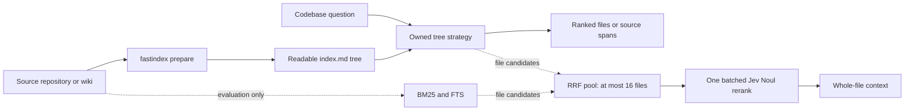

# fastindex

[](https://github.com/manojbajaj95/fastindex/actions/workflows/ci.yml)
[](https://www.python.org/)
[](LICENSE)
[](#research-preview)

**Model-guided code context retrieval through small, readable repository trees.**

<p align="center">
  
</p>

Fastindex is for retrieval researchers and agent-tool builders who want to measure how
quickly a system can find evidence for codebase questions. Its primary use case is
retrieving files and line spans before an agent answers—not generating the answer.

> [!WARNING]
> **Research preview.** The headline result is one 48-question run against one Python
> repository. Fastindex is not a production search engine, does not guarantee `O(log n)`
> retrieval, and has an up-front model-based indexing cost.

## Why this exists

Coding agents can find strong context by searching interactively, but that search takes
time and model calls. Flat lexical search is fast, but often misses semantic routes.
Fastindex tests a middle path: prepare a lightweight directory index once, use typed tree
decisions plus lexical candidates to find a small set of files, and stop when the context
is ready for a downstream consumer.

On Codebase QA, the strongest measured hybrid found every curated gold span for 38 of
48 questions, compared with 41 of 48 for a plain Pi retrieval agent. It averaged 4.19
seconds per query versus Pi's 19.40 seconds.

| Retriever | Complete context | Mean gold coverage | Time/query | Retrieval time per complete result |
|---|---:|---:|---:|---:|
| Plain Pi retrieval agent | **41/48 (85.4%)** | **0.932** | 19.40 s | 22.71 s |
| Fastindex hybrid | 38/48 (79.2%) | 0.905 | **4.19 s** | **5.29 s** |

The last column divides total retrieval time by the number of complete-context queries.
The hybrid produced a complete result 4.3 times faster by that measure, with a 6.2-point
lower complete-context rate. Pi returned precise spans; the hybrid returned whole files
under a 200,000-character cap, so context size is not directly comparable.

## Quickstart: retrieve from the sample bundle

With [uv](https://docs.astral.sh/uv/) and a TypeSafe API key, this takes less than five
minutes and does not regenerate the prepared sample indexes:

```bash
git clone https://github.com/manojbajaj95/fastindex.git
cd fastindex
uv sync --extra dev

export TYPESAFE_API_KEY="..."
uv run fastindex query examples/sample-bundle \
  "Which coffee bean supplier is used for espresso?" \
  --strategy tree-decision --top-k 4
```

The result includes `operations/vendors/alpine-roasters.md` with the supporting source
lines. To check the checkout without any provider credentials:

```bash
uv run fastindex lint examples/sample-bundle
uv run pytest -q
```

## Installation

Fastindex requires Python 3.11 or newer. Install the CLI from GitHub:

```bash
uv tool install git+https://github.com/manojbajaj95/fastindex
fastindex --version
```

For development or evaluation work:

```bash
git clone https://github.com/manojbajaj95/fastindex.git
cd fastindex
uv sync --extra dev
```

## How it works



`fastindex prepare` writes an `index.md` in each visible directory, working from leaves
to root. Each index summarizes its immediate files and child directories. Queries then
walk only plausible branches:

- `tree-reason` asks a configured text model which branches and source sections matter.
- Experimental `tree-decision` uses TypeSafe Jev probabilities for branch and section
  choices.
- The evaluated hybrid returns Jev-reached files without section selection, adds unique
  BM25 and FTS files, caps the fused pool at 16, reranks it in one Noul request, and
  returns the highest-ranked whole files.

BM25, FTS, Pi, vector search, and Cognee remain evaluation sidecars under `evals/`.
They are not public Fastindex strategies.


## Prepare and query your own repository

Preparation and `tree-reason` use LiteLLM. Set the model and its provider key, then:

```bash
export FASTINDEX_MODEL=gpt-5.6-luna

uv run fastindex prepare PATH_TO_REPOSITORY
uv run fastindex query PATH_TO_REPOSITORY \
  "Where is request context isolation implemented?" \
  --strategy tree-reason --top-k 8 --verbose
```

Preparation sends source text to the configured provider. Querying sends only visited
indexes and selected file previews. Existing nonempty indexes are kept unless `--force`
is passed; `--force` overwrites hand-written indexes.

For the decision strategy:

```bash
export TYPESAFE_API_KEY="..."
uv run fastindex query PATH_TO_REPOSITORY \
  "Where is request context isolation implemented?" \
  --strategy tree-decision --decision-model typesafe/jev-latest
```

## CLI

| Command | Purpose |
|---|---|
| `fastindex prepare` | Generate model-written directory indexes from the bottom up |
| `fastindex query` | Return ranked evidence from an owned tree strategy |
| `fastindex lint` | Validate an OKF Markdown bundle and its links |
| `fastindex generate-index` | Build indexes from concept frontmatter without model summaries |

## Examples

- [`examples/sample-bundle`](examples/sample-bundle) is a prepared wiki for quick CLI
  experiments.
- [`examples/tree_reason_gif.py`](examples/tree_reason_gif.py) renders the retrieval
  animation used above.
- [`evals/fixtures/queries/codebase_qa.jsonl`](evals/fixtures/queries/codebase_qa.jsonl)
  contains the tracked Codebase QA retrieval gold.
- [`docs/tree-reason.md`](docs/tree-reason.md) and
  [`docs/tree-decision-evaluation.md`](docs/tree-decision-evaluation.md) describe the
  owned strategies and their tradeoffs.

## Benchmarks

The headline evaluation used all 48 Codebase QA questions against Flask commit
`85c5d93`: 99 curated gold spans across 30 files. A query has complete context only when
the returned context overlaps every gold span. Answer generation is excluded.

The detailed studies live in `docs/`:

- [Hybrid retrieval study](docs/hybrid-evaluation.md): Pi comparison, candidate-source
  experiments, RRF and Noul ablations, failures, reproduction, and next studies.
- [Tree-decision evaluation](docs/tree-decision-evaluation.md): matched decision-model
  retrieval quality, latency, cost, and routing-prompt findings.
- [Tree-reason design](docs/tree-reason.md): traversal behavior, budgets, emitted
  evidence, and limitations.

Raw runs stay in gitignored `evals/results/`; benchmark tables in the docs record the
measured artifacts rather than implying production guarantees.

## Research preview

Known limits and open questions:

- The hybrid and Pi headline results are single runs on one Python repository, so
  variance and cross-language generalization are unknown.
- The comparison excludes one-time preparation. The existing Flask artifact has 52
  generated indexes covering 234 source files, but its complete setup cost was not
  captured.
- Whole-file context avoids brittle section selection but returns substantially more
  text than Pi's spans.
- The tree does not follow symbol references or cross-file links after retrieval, so
  multi-hop assembly remains weak.
- The next useful experiments are repeated runs, adaptive file-count selection, and
  symbol-level context extraction after file reranking.

Do not present these results as a production guarantee or as evidence of logarithmic
worst-case retrieval.

## Contributing

Contributions are welcome. Start with [CONTRIBUTING.md](CONTRIBUTING.md), follow the
[Code of Conduct](CODE_OF_CONDUCT.md), and open a focused pull request against `main`.

## License

[MIT](LICENSE)
