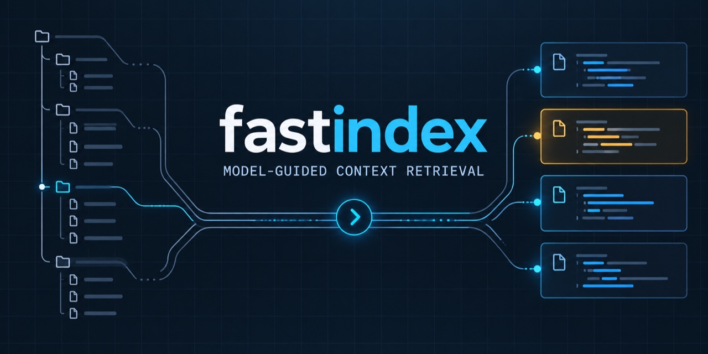
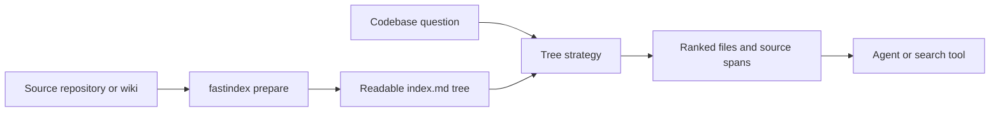
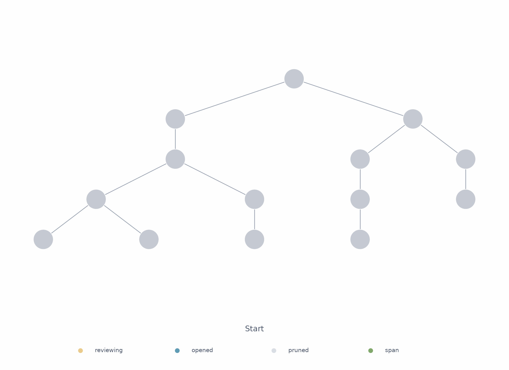

# fastindex

[](https://github.com/manojbajaj95/fastindex/actions/workflows/ci.yml)
[](https://www.python.org/)
[](LICENSE)

**Fastindex finds the code your agent needs, then gets out of the way.**

<p align="center">
  
</p>

We built Fastindex around a simple idea: a repository is already a tree. Prepare that
tree once, route each question through the branches that matter, and return the source
context before an agent burns time searching for it.

Fastindex is built for coding agents, code search tools, and anyone tired of paying a
large model to rediscover the same repository on every question.

## 4x faster. 10x cheaper.

On the 48-question Codebase QA benchmark, our best Fastindex hybrid retrieved context
in 4.19 seconds for $0.00068 per query. Pi, running OpenAI's cost-optimized
`gpt-5.6-luna`, took 19.40 seconds and $0.00656 per query.

| Retriever | Time/query | Cost/query | Relative to Fastindex |
|---|---:|---:|---:|
| **Fastindex hybrid** | **4.19 s** | **$0.00068** | **1x** |
| Pi + `gpt-5.6-luna` | 19.40 s | $0.00656 | 4.6x slower, 9.6x higher cost |

That hybrid combines Fastindex tree routing with evaluation-only BM25 and FTS
sidecars. Read the [full retrieval study](docs/hybrid-evaluation.md) for quality,
methodology, ablations, context-size differences, and reproduction steps.

## Quickstart

With [uv](https://docs.astral.sh/uv/) and a TypeSafe API key, you can retrieve from the
prepared sample bundle in less than five minutes:

```bash
git clone https://github.com/manojbajaj95/fastindex.git
cd fastindex
uv sync --extra dev

export TYPESAFE_API_KEY="..."
uv run fastindex query examples/sample-bundle \
  "Which coffee bean supplier is used for espresso?" \
  --strategy tree-decision --top-k 4
```

Fastindex returns `operations/vendors/alpine-roasters.md` with the supporting source
lines. You can check the checkout without provider credentials:

```bash
uv run fastindex lint examples/sample-bundle
uv run pytest -q
```

## Installation

Fastindex requires Python 3.11 or newer. Install the CLI from GitHub:

```bash
uv tool install git+https://github.com/manojbajaj95/fastindex
fastindex --version
```

For development or evaluation work:

```bash
git clone https://github.com/manojbajaj95/fastindex.git
cd fastindex
uv sync --extra dev
```

## How it works



`fastindex prepare` writes an `index.md` in each visible directory, working from the
leaves to the root. Each index summarizes its immediate files and child directories.
At query time, Fastindex walks only the plausible branches and returns ranked evidence:

- `tree-reason` asks a configured text model which branches and source sections matter.
- `tree-decision` uses TypeSafe Jev probabilities to choose branches and sections.

The indexes stay readable, editable, and close to the source. There is no vector
database to run and no opaque embedding index to debug.



## Use it on your repository

Preparation and `tree-reason` use LiteLLM. Set the model and its provider key, then:

```bash
export FASTINDEX_MODEL=gpt-5.6-luna

uv run fastindex prepare PATH_TO_REPOSITORY
uv run fastindex query PATH_TO_REPOSITORY \
  "Where is request context isolation implemented?" \
  --strategy tree-reason --top-k 8 --verbose
```

Preparation sends source text to the configured provider. Querying sends only visited
indexes and selected file previews. Fastindex keeps existing nonempty indexes unless
you pass `--force`.

For the decision strategy:

```bash
export TYPESAFE_API_KEY="..."
uv run fastindex query PATH_TO_REPOSITORY \
  "Where is request context isolation implemented?" \
  --strategy tree-decision --decision-model typesafe/jev-latest
```

## CLI

| Command | What it does |
|---|---|
| `fastindex prepare` | Generates readable directory indexes from the bottom up |
| `fastindex query` | Returns ranked evidence from a tree strategy |
| `fastindex lint` | Validates an OKF Markdown bundle and its links |
| `fastindex generate-index` | Builds indexes from concept frontmatter without model summaries |

## Read more

- [Hybrid retrieval study](docs/hybrid-evaluation.md) covers the Pi comparison,
  retrieval quality, cost, latency, ablations, failures, and reproduction.
- [Tree-decision evaluation](docs/tree-decision-evaluation.md) covers matched
  decision-model retrieval and routing-prompt experiments.
- [Tree-reason design](docs/tree-reason.md) covers traversal, budgets, and emitted
  evidence.
- [`examples/sample-bundle`](examples/sample-bundle) is a prepared wiki for quick CLI
  experiments.

## Contributing

Contributions are welcome. Start with [CONTRIBUTING.md](CONTRIBUTING.md), follow the
[Code of Conduct](CODE_OF_CONDUCT.md), and open a focused pull request against `main`.

## License

[MIT](LICENSE)
